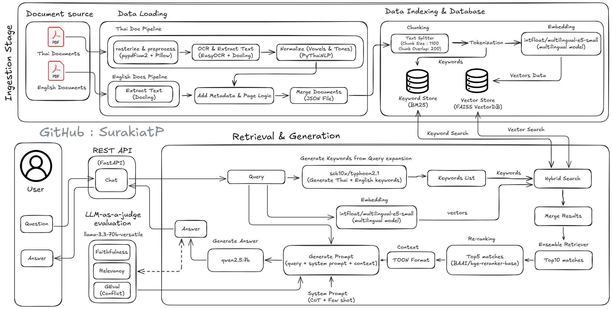

# Multi Stage Retrieval RAG System

A Bilingual (Thai/English) Retrieval-Augmented Generation system for corporate policy and employee handbook queries, featuring hybrid search, cross-encoder reranking, and temporal conflict resolution.

---

## Overview

### Problem Statement
Corporate policies and employee handbooks are frequently updated, creating challenges in maintaining accurate information retrieval. Employees need quick, reliable answers from multiple policy documents while ensuring they receive the most current information when conflicts arise between old and new policies.

### Solution
This RAG system implements a sophisticated hybrid retrieval pipeline combining BM25 keyword search with FAISS dense retrieval, enhanced by cross-encoder reranking. The system automatically detects and resolves temporal conflicts between policy versions (e.g., 2024 vs 2025 updates) and provides grounded answers with exact source citations.

### Key Features
- **Bilingual Support**: Native Thai and English language processing with PyThaiNLP tokenization
- **Hybrid Retrieval**: BM25 (40%) + FAISS (60%) with configurable weights for optimal precision/recall
- **Smart Reranking**: Cross-encoder reranking using BAAI/bge-reranker-base (Top-5)
- **Temporal Conflict Resolution**: Automatic prioritization of latest policy updates with explicit version tracking
- **High Accuracy**: 96.7% average score across Faithfulness, Relevancy, and Policy Compliance metrics
- **Production Ready**: FastAPI-based REST API with comprehensive error handling and logging

---

## Architecture

### System Architecture Diagram


**Note:** You can also refer to the original system architecture diagram in the project documentation for a visual representation.


### Tech Stack

| Component | Technology | Purpose |
|-----------|-----------|---------|
| **API Framework** | FastAPI 0.109.0 | REST API server |
| **LLM (Expansion)** | scb10x/typhoon2.1-gemma3-4b | Thai/English query expansion |
| **LLM (Generation)** | qwen2.5:7b-instruct-q4_0 | Answer generation with TOON context |
| **LLM (Evaluation)** | llama-3.3-70b-versatile (Groq) | LLM-as-a-Judge metrics |
| **Embedding Model** | intfloat/multilingual-e5-small | Multilingual dense embeddings |
| **Reranker** | BAAI/bge-reranker-base | Cross-encoder reranking |
| **Vector Store** | FAISS (CPU) | Dense retrieval index |
| **Keyword Search** | rank_bm25 | Sparse retrieval with PyThaiNLP tokenization |
| **RAG Framework** | LangChain 0.2.6 | Retrieval pipeline orchestration |
| **Document Processing** | Docling, pypdfium2, EasyOCR | PDF parsing and OCR |
| **Thai NLP** | PyThaiNLP | Tokenization and text normalization |
| **Data Format** | TOON Format | Tabular context representation |
| **Evaluation** | DeepEval | Faithfulness, Relevancy, GEval metrics |

### Pipeline Flow

**Stage 1: Ingestion**
- PDF documents uploaded to `dataset/` folder
- Thai documents: Rasterized → OCR (EasyOCR) → Normalized (PyThaiNLP)
- English documents: Direct text extraction (Docling)
- Output: `ingested_data/ingested_documents.json`

**Stage 2: Data Loading**
- JSON documents loaded into LangChain Document format
- Metadata preserved (source filename, logical page number)

**Stage 3: Indexing**
- Text splitting: 1200 characters, 300 overlap
- Parallel indexing:
  - FAISS: Dense embeddings (multilingual-e5-small)
  - BM25: Keyword index (PyThaiNLP tokenizer)
- Indexes saved to `database/` (FAISS + BM25 pickle)

**Stage 4: Retrieval & Generation**
- Query expansion (Typhoon2.1): Thai/English keyword pairs
- Hybrid retrieval: Top-10 from each retriever
- Ensemble weighting: BM25 (40%) + FAISS (60%)
- Reranking: Cross-encoder selects Top-5
- Answer generation: Qwen2.5 with TOON-formatted context
- Automatic citation: [Source: filename, Page: X]

---

## Quick Start

### Prerequisites
- Python 3.10+
- Ollama installed and running ([Installation Guide](https://ollama.ai))
- CUDA-compatible GPU (optional, CPU supported)
- 16GB+ RAM recommended

### Installation

**Step 1: Clone and setup environment**
```bash
git clone https://github.com/SurakiatP/Multi-Stage-Retrieval-RAG.git
cd corporate-policy-rag
python -m venv .venv
source .venv/bin/activate  # Windows: .venv\Scripts\activate
```
**Step 2: Install PyTorch FIRST (CUDA Version select for Your GPU)**
pip install torch torchvision --index-url https://download.pytorch.org/whl/cu124

**Step 3: Install dependencies**
```bash
pip install -r requirements.txt
```

**Step 4: Pull required Ollama models**
```bash
ollama pull scb10x/typhoon2.1-gemma3-4b
ollama pull qwen2.5:7b-instruct-q4_0
```

**Step 5: Configure environment**
```bash
cp .env.example .env
# Edit .env with your settings (see Configuration section)
```

**Step 6: Prepare documents**
```bash
# Place PDF files in dataset/ folder
mkdir -p dataset
cp your-policies.pdf dataset/
```

**Step 7: Process documents and build index**
```
# Process PDFs and create JSON
python src/document_processor.py

# Build FAISS + BM25 indexes
python src/rag_engine.py
```
### Basic Usage

**Start API server:**
```bash
python app.py
# Server runs at http://localhost:8000
```

**Query via API:**
```bash
curl -X POST "http://localhost:8000/chat" \
  -H "Content-Type: application/json" \
  -d '{"question": "What is the mileage reimbursement rate?"}'
```

**Response example:**
```json
{
  "answer": "The current mileage rate is 12 THB per kilometer [Source: Internal-Memo-2025.pdf, Page: 1]",
  "expanded_query": "ค่าพาหนะ Mileage อัตรา Rate รถยนต์ Car",
  "retrieved_docs": [...],
  "processing_time": 2.34
}
```

---

## Project Structure

```
corporate-policy-rag/
│
├── app.py                          # FastAPI application entry point
├── requirements.txt                # Python dependencies
├── .env.example                    # Environment configuration template
│
├── dataset/                        # Input PDF documents
│   ├── Employee-Handbook-2024.pdf
│   ├── Benefits-Policy-2024.pdf
│   ├── IT-Security-Policy.pdf
│   └── Internal-Memo-2025.pdf
│
├── database/                       # Generated indexes
│   ├── faiss_index/               # FAISS vector store
│   └── bm25_retriever.pkl         # BM25 keyword index
│
├── ingested_data/                  # Processed documents
│   ├── ingested_documents.json    # Extracted text with metadata
│   └── ingested_documents.toon    # TOON format (optional)
│
├── src/                            # Core modules
│   ├── document_processor.py      # PDF ingestion (Thai/English)
│   ├── rag_engine.py              # Hybrid retrieval + reranking
│   ├── llm_client.py              # Ollama LLM interface
│   └── json_to_toon.py            # TOON format converter
│
└── tests/                          # Evaluation suite
    ├── eval_rag.py                # DeepEval metrics runner
    └── test_cases.json            # 10 test cases with ground truth
```

**Key Files:**
- `document_processor.py`: Handles Thai OCR pipeline and English text extraction
- `rag_engine.py`: Implements hybrid retrieval (BM25+FAISS) with cross-encoder reranking
- `llm_client.py`: Manages query expansion (Typhoon) and answer generation (Qwen)
- `app.py`: REST API with `/chat` and `/rebuild-index` endpoints

---

## Configuration

### Environment Variables

Copy `.env.example` to `.env` and configure:

```bash
# Ollama Configuration
OLLAMA_BASE_URL=http://localhost:11434

# LLM Models
LLM_EXPAND_MODEL_NAME=scb10x/typhoon2.1-gemma3-4b:latest
LLM_GENERATE_MODEL_NAME=qwen2.5:7b-instruct-q4_0
LLM_TEMPERATURE=0.2
LLM_TIMEOUT=120.0

# Embedding Configuration
EMBEDDING_DEVICE=cuda                              # or 'cpu'
EMBEDDING_MODEL_NAME=intfloat/multilingual-e5-small
RERANKER_MODEL_NAME=BAAI/bge-reranker-base

# Retrieval Parameters
CHUNK_SIZE=1200
CHUNK_OVERLAP=300
RETRIEVAL_K=10
RERANK_TOP_N=5

# Paths
DATASET_PATH=dataset/
DATABASE_PATH=database/
OUTPUT_PATH=ingested_data/

# Evaluation (Optional)
GROQ_API_KEY=your-groq-api-key
```

### Key Parameters

| Parameter | Default | Description | Impact |
|-----------|---------|-------------|--------|
| `CHUNK_SIZE` | 1200 | Characters per text chunk | Higher = more context per chunk |
| `CHUNK_OVERLAP` | 300 | Overlap between chunks | Higher = less context loss |
| `RETRIEVAL_K` | 10 | Documents retrieved per method | Higher = more candidates, slower |
| `RERANK_TOP_N` | 5 | Final documents after reranking | Sent to LLM for answer generation |
| `LLM_TEMPERATURE` | 0.2 | Generation randomness (0-1) | Lower = more deterministic |

### Customization Options

**Adjust Hybrid Search Weights** (in `rag_engine.py`):
```python
ensemble_retriever = EnsembleRetriever(
    retrievers=[self.bm25_retriever, faiss_retriever],
    weights=[0.4, 0.6]  # BM25: 40%, FAISS: 60%
)
```

**Modify Thai Tokenizer** (in `rag_engine.py`):
```python
def thai_tokenizer(text: str) -> List[str]:
    return word_tokenize(text, engine="newmm")  # Options: "newmm", "deepcut"
```

**Change Reranker Model** (in `.env`):
```bash
RERANKER_MODEL_NAME=BAAI/bge-reranker-v2-m3  # Multilingual alternative
```

---

## Usage Examples

### Example 1: Process New Documents
```bash
# Add PDFs to dataset/
cp new-policy.pdf dataset/

# Rebuild index
python src/document_processor.py
python src/rag_engine.py

# Or use API endpoint
curl -X POST "http://localhost:8000/rebuild-index"
```

### Example 2: Query via Python
```python
from src.rag_engine import RAGEngine
from src.llm_client import LLMClient

# Initialize
engine = RAGEngine()
engine.load_index()
client = LLMClient()

# Query
query = "How many days can I work from home?"
expanded = client.expand_query(query)
docs = engine.search(expanded)
answer = client.generate_answer(query, docs)

print(answer)
# Output: "Employees must work in the office at least 3 days per week..."
```

### Example 3: Custom Query Expansion
```python
# Test query expansion only
client = LLMClient()
query = "ค่าเดินทางรถยนต์"
expanded = client.expand_query(query)

print(expanded)
# Output: "ค่าเดินทาง Travel Allowance รถยนต์ Car อัตรา Rate..."
```

### Example 4: Check Retrieved Context
```python
from src.rag_engine import RAGEngine, results_to_toon_context

engine = RAGEngine()
engine.load_index()

docs = engine.search("mileage rate")
context = results_to_toon_context(docs)

print(context)
# Output: TOON-formatted context with [N]{source,page,content}
```
### Example 5: Available API Endpoints

**Health Check:**
`````bash
curl http://localhost:8000/health
`````

**Chat Query:**
`````bash
curl -X POST "http://localhost:8000/chat" \
  -H "Content-Type: application/json" \
  -d '{"question": "Your question here"}'
`````

**Rebuild Index:**
`````bash
curl -X POST "http://localhost:8000/rebuild-index"
`````

**API Documentation:**

Visit `http://localhost:8000/docs` for interactive Swagger UI

## Evaluation Results

### Metrics Summary

| Metric | Average Score | Status |
|--------|---------------|--------|
| **Faithfulness** | 0.975 | Excellent |
| **Answer Relevancy** | 0.985 | Excellent |
| **GEval (Policy Compliance)** | 0.98 | Excellent |
| **Overall** | **96.7%** | Production Ready |

### Test Cases Performance (10 Cases)

| Case | Query | Faithfulness | Relevancy | GEval |
|------|-------|--------------|-----------|-------|
| 1 | Current Mileage Rate | 1.00 | 0.75 | 1.00 |
| 2 | Domestic Daily Allowance | 1.00 | 1.00 | 1.00 |
| 3 | Office Attendance Days | 1.00 | 1.00 | 1.00 |
| 4 | Lost Laptop Reporting | 0.75 | 1.00 | 1.00 |
| 5 | Mandatory Core Hours | 1.00 | 1.00 | 1.00 |
| 6 | Probation Period | 1.00 | 1.00 | 0.80 |
| 7 | Annual Leave (3 years) | 1.00 | 1.00 | 1.00 |
| 8 | Vision Benefit (Level 3) | 1.00 | 0.90 | 1.00 |
| 9 | Expense Claim Deadline | 1.00 | 1.00 | 1.00 |
| 10 | Stolen Laptop Liability | 0.90 | 1.00 | 1.00 |

**Key Strengths:**
- Perfect temporal conflict resolution (2024 vs 2025 policies)
- High answer relevancy across diverse query types
- Robust bilingual query understanding
- Accurate source citation in all responses

**Run Evaluation:**
```bash
# Set Groq API key in .env
GROQ_API_KEY=your-key

# Run evaluation suite
cd tests
python eval_rag.py
```

---

## Development

### Setup for Development

**Install additional dev dependencies:**
```bash
pip install pytest black flake8 mypy
```

**Run tests:**
```bash
# Unit tests (if implemented)
pytest tests/

# Evaluation metrics
python tests/eval_rag.py
```

**Code formatting:**
```bash
black src/ tests/
flake8 src/ tests/
```

**Type checking:**
```bash
mypy src/
```

### Project Development Guidelines

1. **Document Processing**: Modify `document_processor.py` for new document types
2. **Retrieval Logic**: Adjust weights in `rag_engine.py` for different domains
3. **Prompt Engineering**: Update system prompts in `llm_client.py` for better grounding
4. **API Endpoints**: Add new routes in `app.py` following FastAPI patterns

---

## Troubleshooting

### Issue 1: Ollama Connection Error
```
Error: Could not connect to Ollama at http://localhost:11434
```
**Solution:**
```bash
# Check if Ollama is running
curl http://localhost:11434

# Start Ollama
ollama serve

# Verify models are pulled
ollama list
```

### Issue 2: Out of Memory (OOM)
```
RuntimeError: CUDA out of memory
```
**Solution:**
```bash
# Option 1: Use CPU instead
EMBEDDING_DEVICE=cpu

# Option 2: Reduce batch size (in rag_engine.py)
encode_kwargs={'batch_size': 16}  # Default: 32/64

# Option 3: Use smaller models
LLM_GENERATE_MODEL_NAME=qwen2.5:3b-instruct-q4_0
```

### Issue 3: Thai Text Garbled Output
```
Output: "à¸à¸²à¸£à¹€à¸"ินทาง"
```
**Solution:**
```bash
# Ensure UTF-8 encoding in all file operations
# Check Python default encoding
python -c "import sys; print(sys.getdefaultencoding())"

# Should output: utf-8
```

### Issue 4: Slow Retrieval Performance
```
Average query time: 15-20 seconds
```
**Solution:**
```bash
# Reduce retrieval candidates
RETRIEVAL_K=10  # Instead of 15

# Use GPU for embeddings
EMBEDDING_DEVICE=cuda

# Reduce reranking set
RERANK_TOP_N=3  # Instead of 5
```

---

## License

MIT License - See LICENSE file for details

---

**Built with LangChain, FastAPI, and Ollama | Optimized for Thai/English Corporate Documents**

## Author

**Surakiat Kansa-ard**
- GitHub: [https://github.com/SurakiatP](https://github.com/SurakiatP)
- LinkedIn: [https://www.linkedin.com/in/surakiat-kansa-ard-171942351/](https://www.linkedin.com/in/surakiat-kansa-ard-171942351)